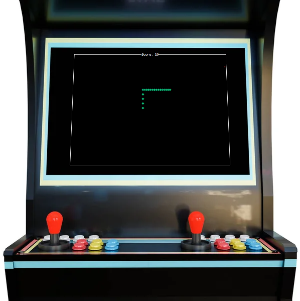
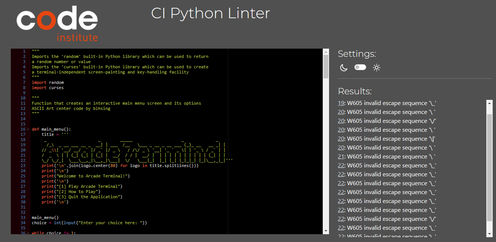

# Arcade Terminal
Developed by **Dorian Wolarz**, a Code Institute Student

*Arcade Terminal is a Python game which runs in the Code Institute mock terminal on the Heroku webpage. Users can play the classic game of Snake, where they maneuver the end of a growing line in order to collect and consume apples, all while avoiding game-ending collisions.*

## Contents
1. [How to Play](#how-to-play)
2. [Features](#features)
3. [Data Model](#data-model)
4. [Planning](#planning)
5. [Technologies Used](#technologies-used)
6. [Testing and Validation](#testing-and-validation)
6. [Known Bugs](#known-bugs)
8. [Deployment](#deployment)
9. [Credits](#credits)

## How to Play

Arcade Terminal is based on the classic game of Snake, which originated in 1976 in the arcade game *'Blockade'*.

The player uses his arrow keys to move the titular Snake around the board.

If the Snake finds an apple, it eats it and grows larger by one segment.

The game ends when the Snake collides with the edge of the terminal screen or with its own tail.

The goal of the game is to make the Snake as large as possible before that happens.

## Features

This application consists of 11 features

### Main Menu
* Activated on application start
* Fits into the terminal screen
* Allows the user to navigate the application's interactive options

### Play Arcade Terminal
* Allows the player to activate the Snake game on correct input
* Fits into the terminal screen

### How to Play
* Informs the user of the rules of gameplay
* Fits into the terminal screen

### Quit the Application
* Allows the user to manually quit the application's terminal screen
* Fits into the terminal screen

### Incorrect Key Input
* Informs the user of incorrect key input
* Reloads the main menu upon incorrect input so that user can see his options and try again
* Fits into the terminal screen

### Snake
* Allows the player to move across the terminal and interact with its environment
* Can grow in size depending on the number of apples eaten
* Activates collisions with the terminal border and its own tail

### Apple
* Can be interacted with and consumed by the Snake
* Spawns in random areas within the terminal screen

### Score
* Located in the center-top of the terminal border for clear visibility
* Keeps track of current player score and increments by one after each apple eaten

### Bounding Box
* Creates a visible border around the edge of the terminal screen
* Informs the player of point of collision

### Wall Collision
* Listens for the collision of the Snake
* Ends the game upon collision with wall and allows the player to exit the terminal by pressing any key

### Self Collision
* Listens for the collision of the Snake
* Ends the game upon collision with self and allows the player to exit the terminal by pressing any key

### Future Features

* Increase the speed of the Snake with every apple eaten
* Add a timer within which an apple needs to be consumed, otherwise it will disappear
* Add rotten apples which remove a part of Snake's tail for eating them

## Data Model

I decided to use functions, for/while loops, if statmenets, dictionaries and lists to complete this project.

### Examples of Functions

* *main_menu* - creates an interactive main menu screen
* *print_score* - builds a current score display in the center of the screen
* *create_apples* - creates random apples within the terminal box and applies basic logic for collisions
* *main* - sets the bounding box border, details the keyboard input and game interactivity

### Examples of For and While Loops

* *main menu while loop* - allows the user to interact with the main menu and input certain keys
* *main function while loop* - initiates the loop that continues to repeat snake movement, apple spawning, tail removal, etc. for as long as the game is being played

### Examples of If Statements

* *main menu if/elif* - initializes correct output depending on which number was input by the player
* *main function if/elif* - responsible for initiating curse colouring, checking collisions, listening to keyboard input and creating new heads depending on Snake movement

### Examples of Dictionaries

* *opposite_keys* - catalogues each directional key and its opposite so they can be cancelled

### Examples of Lists

* *directional_keys* - groups all directional arrow keys into one list so the Snake can move and opposite arrows can be cancelled out
* *snake* - a list of tuples that creates the first three elements of the Snake at game start

## Planning

### Flowchart

Made on free version of *Lucid.app* (I had limited symbol count)

  
Arcade Terminal Flowchart

  

## Technologies Used

### Languages

* Python 3

### Tools and Websites

* Git
* GitHub
* GitPod
* Lucid.app
* CI Python Linter
* Heroku

## Testing and Validation

### CI Python Linter

The only errors showing up are those of ASCII Art

  
CI Python Linter Validation

  

### Feature Testing

1. *Main Menu, Play, How to Play, Quit, Incorrect Input*

| **Feature**  | **Expected Result** | **Action Taken** | **Result** |
| ------------- | ------------- | ------------- | ------------- |
| Main Menu | Display full main menu and ASCII Art | Run *python3 run.py* | Works as Intended |
| Play Arcade Terminal | Game is launched | Input '1' | Works as Intended |
| How to Play | Rules of the game are listed | Input '2' | Works as Intended |
| Quit the Application | Terminal shut down | Input '3' | Works as Intended |
| Incorrect Input | Input not accepted, main menu restarted | Input any number other than '1', '2' or '3' | Works as Intended |

2. *Snake*

| **Feature**  | **Expected Result** | **Action Taken** | **Result** |
| ------------- | ------------- | ------------- | ------------- |
| Movement | Snake moves | Press any arrow key | Works as Intended |
| Blocked Opposites | Snake can't move in opposite direction and eat itself | Press 'right' while going left | Works as Intended |

3. *Apple*

| **Feature**  | **Expected Result** | **Action Taken** | **Result** |
| ------------- | ------------- | ------------- | ------------- |
| Initial Spawn | Apple appears on game start | Run *python3 run.py* | Works as Intended |
| Randomized Apple Generation | Apple spawns in random places after being eaten | Collide Snake's head with apple | Works as Intended |

4. *Bounding Box*

| **Feature**  | **Expected Result** | **Action Taken** | **Result** |
| ------------- | ------------- | ------------- | ------------- |
| Bounding Box | A white box appears, surrounding the game area | Run *python3 run.py* | Works as Intended |

4. *Score*

| **Feature**  | **Expected Result** | **Action Taken** | **Result** |
| ------------- | ------------- | ------------- | ------------- |
| Score Display | Current score is listed above the game area | Run *python3 run.py* | Works as Intended |
| Increase Score | Score is incremented by one | Collide Snake's head with apple | Works as Intended |

5. *Collision Tests*

| **Feature**  | **Expected Result** | **Action Taken** | **Result** |
| ------------- | ------------- | ------------- | ------------- |
| Wall Collision | Game Over at collision with wall | Collide Snake's head with the bounding box | Works as Intended |
| Self Collision | Game Over at collision with self | Collide Snake's head with its tail | Works as Intended |

## Known Bugs

### Unfixed Bugs

| Encountered Bug | Potential Fix |
| ------------- |:-------------:|
| Snake moves faster vertically than horizontally | Reduce the size of the terminal to be of equal width and height |
| Snake can increase speed by holding down key input | Game is controlled by getch() and .timeout, so separating input from time by calculating how much time is needed to sleep between key presses should work |

### Fixed Bugs

| Encountered Bug | The Fix Used |
| ------------- |:-------------:|
| Randomized apple generation not working | Switched the x and y values with the y and x used for tuples |
| Terminal freezing and crashing with no error | Added a curses.wrapper to restore terminal to sane state and display error message as normal |
| Game shutting down immediately after collision | Add new_window.getch() to listen for a key press before closing the terminal |
| Apples spawning within terminal border | Minus '2' from the sh (screen height) and sw (screen width) values in the apple while loop |

## Deployment

This project was deployed using *Code Institute's Python Terminal on Heroku*.

### GitHub

You can *fork the repository* by following these steps:

1. Go to the GitHub repository
2. Click on Fork button in upper right hand corner

You can *clone the repository* by following these steps:

1. Go to the GitHub repository
2. Locate the Code button above the list of files and click on it
3. Select if you prefer to clone using HTTPS, SSH or GitHub CLI and click the copy button to copy the URL to your clipboard
4. Open GitBash
5. Change the current directory to the one you previously cloned
6. Type git clone and paste the URL from the clipboard ($ git clone https://github.com/YOUR-USERNAME/YOUR-REPOSITORY)
7. Press 'Enter' to create your local clone

### Heroku

After the repository is forked, you can deploy it by following these steps:

1. Create an account on Heroku or log into your existing one
2. Go to the *Dashboard*
3. Create a new app, add its name and your geographical region
4. Click on *Create App*
5. Go to your *Settings* tab
6. Under *Config Vars*, add **PORT** for key and **8000** for value
7. Click *Add*
8. Click *Add Buildpack*
9. Add **python** from the list and press *Save Changes*
10. Add **nodejs** from the list and press *Save Changes*
11. Ensure that python is placed **above** nodejs
12. Scroll up and click *Deploy*
13. Navigate to *Deployment Method* and click on *GitHub*
14. Confirm that you want to *Connect to GitHub* and link your account
15. Search for the GitHub repository you had previously forked
16. Click *Connect*
17. Scroll down and click on *Deploy Branch*

## Credits

* *Code Institute* for the Python Essentials template on GitHub
* *Code Institute* for the deployment terminal on Heroku
* *Code Institute* for the Python Linter validation website
* [Documentation for *curses* library](https://docs.python.org/3/library/curses.html#module-curses)
* [Documentation for *random* library](https://www.w3schools.com/python/module_random.asp)
* [*ASCII Art Alignment* by blhsing](https://stackoverflow.com/questions/51606897/ascii-characters-text-align)
* [*Text to ASCII Art* website by patorjk](https://patorjk.com/software/taag/#p=display&h=2&v=2&f=Ogre&t=Arcade%20Terminal)
* [TUTORIAL and some Code Help: *Snake Game for Terminal* by Indian Pythonista](https://www.youtube.com/watch?v=BvbqI6eDh0c)
* [TUTORIAL: *Snake in the Powershell* by Clear Code](https://www.youtube.com/watch?v=lAIawk2IVIM)
* [TUTORIAL: *Snake Game in Python* by Patrick Loeber](https://www.youtube.com/watch?v=M_npdRYD4K0)
* [TUTORIAL: *Python Snake Game* by Mision Codigo](https://www.youtube.com/watch?v=_IKIkRMfZJA)